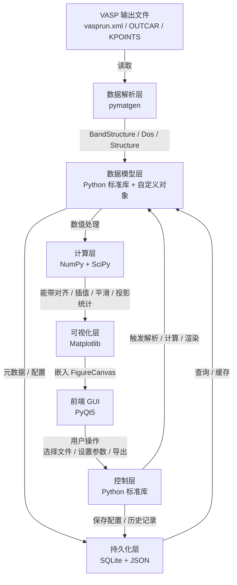

# 2D Material Band Structure Visualizer for Raspberry Pi 4B

基于树莓派4B的二维材料能带结构可视化工具。

---

## 1. 项目概述

本项目旨在树莓派 4B（ARM64 / ARMv7）平台上，开发一款面向二维材料第一性原理计算结果的可视化工具。数据来源为 **VASP** 计算输出，解析层采用 **pymatgen** 提取能带与投影信息，后端以 **Python 标准库 + NumPy** 完成数据处理，使用 **SciPy** 提供插值、平滑等辅助计算，通过 **SQLite + JSON** 持久化计算元数据与配置，最终由 **PyQt5** 构建桌面前端，并借助 **Matplotlib** 渲染能带结构图、态密度图、投影能带图等。

---

## 2. 运行环境

- 硬件：Raspberry Pi 4B（4GB / 8GB RAM 推荐）
- 操作系统：Raspberry Pi OS 64-bit（Bookworm 或更新）
- Python：3.9+
- 显示：可直接接入 HDMI 显示器，或通过网络 VNC 远程使用

---

## 3. 技术栈

| 模块 | 选型 | 说明 |
|------|------|------|
| 计算数据源 | VASP | `vasprun.xml`、`OUTCAR`、`KPOINTS` 等 |
| 数据解析 | pymatgen | 解析能带、态密度、投影、结构信息 |
| 数值计算 | NumPy + SciPy | 数组运算、插值、平滑、拟合 |
| 基础后端 | Python 标准库 | 文件 IO、进程管理、日志、配置、缓存 |
| 数据存储 | SQLite + JSON | 元数据与索引存 SQLite；配置与导出数据存 JSON |
| 图表渲染 | Matplotlib | 能带图、DOS 图、投影能带热图等 |
| 前端 GUI | PyQt5 | 跨平台桌面界面，适配树莓派触屏/键鼠 |

---

## 4. 系统架构与流程图



---

## 5. 各模块具体实现目标

### 5.1 数据解析层（pymatgen）

- **目标**：稳定读取 VASP 输出，抽象为统一数据模型。
- **实现要点**：
  - 使用 `pymatgen.io.vasp.outputs.Vasprun` 解析 `vasprun.xml`；
  - 使用 `pymatgen.io.vasp.outputs.Outcar` 读取额外信息（如磁矩、能带占据）；
  - 使用 `pymatgen.io.vasp.inputs.Kpoints` 获取高对称点路径与标签；
  - 兼容 `pymatgen.electronic_structure` 中的 `BandStructure`、`Dos`、`CompleteDos`；
  - 异常处理：文件缺失、解析失败、计算未收敛时给出友好提示。

### 5.2 数据模型层（Python 标准库）

- **目标**：定义项目内部统一的数据结构，隔离 pymatgen 与上层逻辑。
- **实现要点**：
  - 定义 `BandData`、`DosData`、`ProjectedData`、`MaterialInfo` 等数据类；
  - 使用 `dataclasses` 或 `typing.NamedTuple` 降低内存开销；
  - 提供数据校验、单位转换、版本化序列化接口；
  - 管理文件路径、计算任务 ID、标签等元信息。

### 5.3 计算层（NumPy + SciPy）

- **目标**：高性能完成能带数据处理与科学计算。
- **实现要点**：
  - 使用 NumPy 进行 k 点距离累加、能量对齐、能带裁剪、高对称点标注；
  - 使用 SciPy 实现能带曲线的插值（`scipy.interpolate`）与平滑（`scipy.ndimage` / `savgol_filter`）；
  - 支持费米能级对齐、直接/间接带隙计算、有效质量近似估算；
  - 投影能带：按元素、轨道、自旋通道进行权重统计与归一化；
  - 计算结果缓存，避免重复解析大文件。

### 5.4 持久化层（SQLite + JSON）

- **目标**：持久化计算元数据、用户配置与历史记录，支持快速检索。
- **实现要点**：
  - **SQLite**：
    - 存储任务表（路径、名称、体系、晶格常数、带隙、计算时间戳）；
    - 存储高对称点路径、能量范围、图形参数等历史记录；
    - 支持按材料、时间、带隙范围查询。
  - **JSON**：
    - 存储用户全局配置（主题、默认能量范围、导出格式）；
    - 存储单次计算的导出结果（如能带数据、投影权重），便于后续复现或离线分析。

### 5.5 可视化层（Matplotlib）

- **目标**：生成高质量、可交互的二维材料能带图与态密度图。
- **实现要点**：
  - 能带结构图：k 点路径、高对称点标签、费米能级参考线、多自旋绘制；
  - 总态密度 / 分波态密度（TDOS / PDOS）图；
  - 投影能带图：使用颜色映射（colormap）表示原子/轨道投影权重；
  - 支持图形主题、字体大小、导出分辨率配置；
  - 在树莓派上采用 `Agg` / `Qt5Agg` 后端，确保渲染流畅。

### 5.6 前端 GUI（PyQt5）

- **目标**：提供直观的桌面操作界面，适配树莓派使用场景。
- **实现要点**：
  - 主窗口：侧边栏导航 + 中央 Matplotlib 画布区；
  - 文件管理：浏览/拖拽 VASP 文件、最近打开列表、任务列表；
  - 参数面板：设置能量范围、高对称点路径、投影元素/轨道、颜色主题；
  - 交互功能：缩放、平移、保存图片、导出数据、一键重绘；
  - 状态栏与进度条：显示解析/计算/渲染进度；
  - 在树莓派上限制后台线程数，避免阻塞 GUI。

### 5.7 控制层（Python 标准库）

- **目标**：协调各模块工作，处理用户事件与异步任务。
- **实现要点**：
  - 使用 `threading` 或 `concurrent.futures` 在后台执行解析与计算；
  - 使用 `logging` 记录运行日志，便于调试；
  - 使用 `configparser` 或 JSON 管理应用配置；
  - 定义统一错误码与提示信息，向 GUI 反馈异常。

---

## 6. 推荐项目结构

```
.
├── README.md
├── requirements.txt
├── main.py
├── config/
│   └── default_config.json
├── src/
│   ├── __init__.py
│   ├── parser/              # pymatgen 解析器封装
│   │   ├── __init__.py
│   │   └── vasp_parser.py
│   ├── models/              # 内部数据模型
│   │   ├── __init__.py
│   │   ├── band_data.py
│   │   ├── dos_data.py
│   │   └── material_info.py
│   ├── compute/             # NumPy / SciPy 计算
│   │   ├── __init__.py
│   │   ├── band_processor.py
│   │   ├── gap_calculator.py
│   │   └── projector.py
│   ├── storage/             # SQLite + JSON 持久化
│   │   ├── __init__.py
│   │   ├── database.py
│   │   └── config_manager.py
│   ├── plotter/             # Matplotlib 绘图
│   │   ├── __init__.py
│   │   ├── band_plotter.py
│   │   ├── dos_plotter.py
│   │   └── projected_band_plotter.py
│   └── gui/                 # PyQt5 界面
│       ├── __init__.py
│       ├── main_window.py
│       ├── widgets/
│       └── workers/
├── tests/                   # 单元测试与示例数据
│   ├── sample_data/
│   └── test_parser.py
└── docs/                    # 额外文档（可选）
```

---

## 7. 快速开始

### 7.1 安装依赖

```bash
# 在树莓派上建议使用虚拟环境
python3 -m venv venv
source venv/bin/activate

pip install --upgrade pip
pip install -r requirements.txt
```

### 7.2 运行程序

```bash
python main.py
```

### 7.3 加载 VASP 数据

1. 点击“打开文件”选择 `vasprun.xml`；
2. 在参数面板设置能量范围、投影元素/轨道；
3. 点击“绘制”查看能带图或态密度图；
4. 使用“导出”保存图片（PNG/PDF）或数据（JSON）。

---

## 8. 依赖列表（requirements.txt 示例）

```text
PyQt5>=5.15
matplotlib>=3.5
numpy>=1.21
scipy>=1.7
pymatgen>=2023.0
```

> 在树莓派上安装 PyQt5 与 Matplotlib 时，可能需要额外系统依赖，如 `libqt5gui5`、`python3-pyqt5`、`libfreetype6-dev` 等。

---

## 9. 后续可扩展方向

- 支持更多第一性原理计算软件（如 Quantum ESPRESSO、ABACUS）的输出；
- 增加费米面 / 3D 能带可视化（受限于树莓派性能，可简化采样）；
- 支持将 SQLite 数据上传至局域网内的 Web 服务端；
- 增加能带对齐、异质结界面分析等进阶功能；
- 适配触屏操作，优化树莓派小屏幕 UI 布局。

---

## 10. 许可证

MIT License
