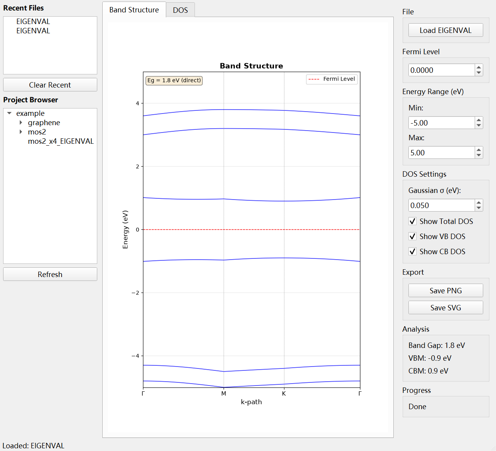
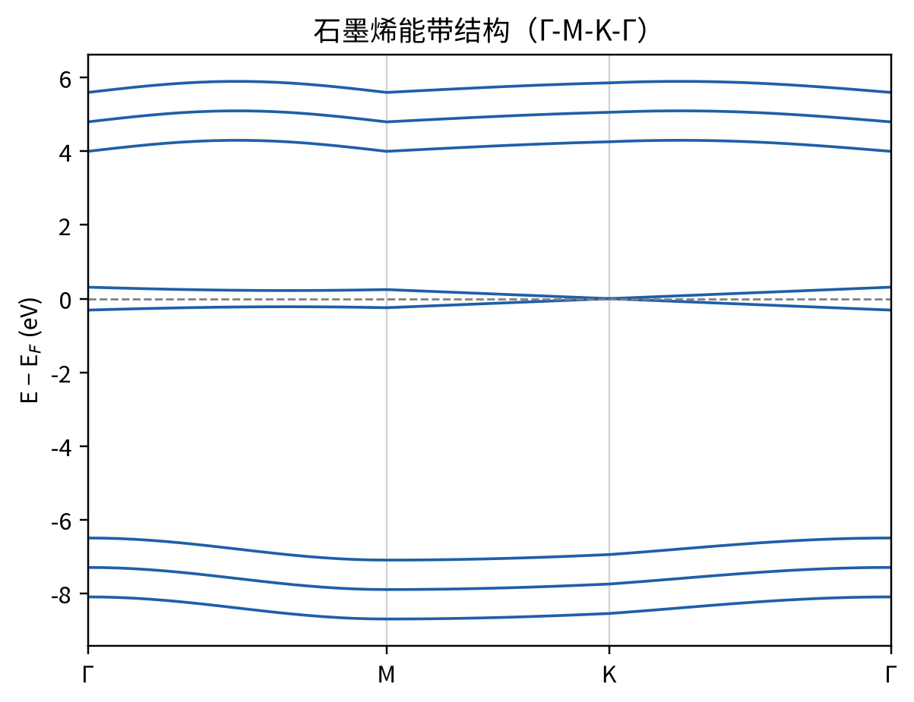
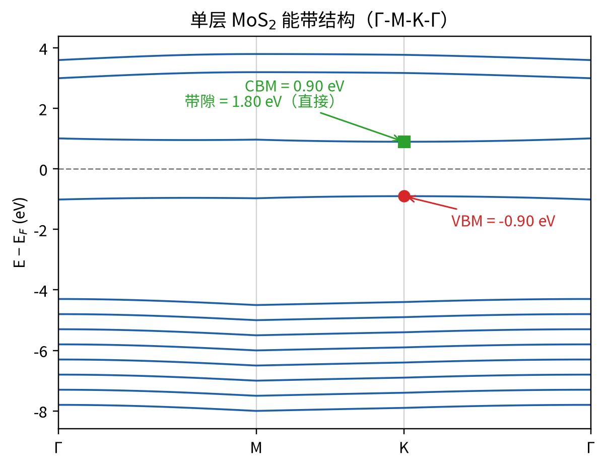
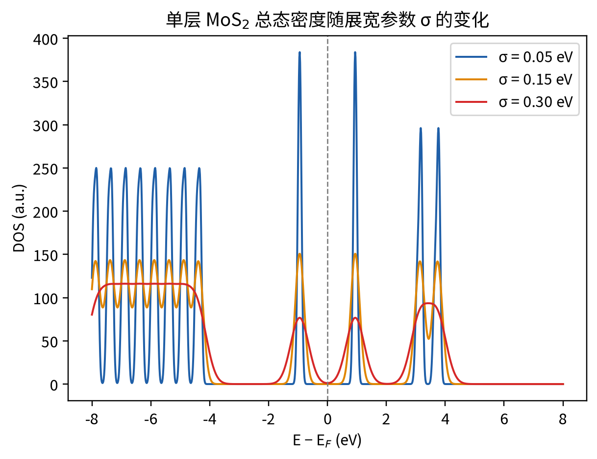

# 2D Material Band Structure Visualizer

> 基于 Raspberry Pi 4B 的二维材料能带结构可视化工具

直接从 VASP 的 `EIGENVAL` 与 `KPOINTS` 文件读取数据，实时绘制能带图与态密度图（DOS），并自动计算带隙、有效质量等关键参数。



---

## 功能特性

- **能带结构可视化** — 自动读取 EIGENVAL + KPOINTS，绘制带高对称点标注的能带图
- **态密度（DOS）** — 基于高斯展宽实时计算总 DOS、价带 DOS、导带 DOS
- **带隙分析** — 自动判断直接/间接带隙，计算 VBM / CBM
- **有效质量估算** — 在带边附近抛物线拟合估算有效质量
- **后台解析** — 使用 QThread 异步解析，大文件不卡界面
- **配置持久化** — JSON 保存用户设置，SQLite 记录计算历史
- **文件树管理** — 左侧目录浏览器 + 最近文件列表，双击即加载
- **导出图片** — 支持 PNG / SVG 高清导出

---

## 快速开始

```bash
# 1. 安装依赖
pip install -r requirements.txt

# 2. 运行
python main.py
```

程序启动后，左侧文件树会自动扫描 `data/example/` 下的示例数据。双击 **graphene** 或 **mos2** 即可加载并查看能带图与 DOS 图。

### 基本操作

| 操作 | 说明 |
|------|------|
| 加载文件 | 点击 **Load EIGENVAL** 或双击文件树中的 `EIGENVAL` |
| 切换视图 | 中央 Tab 切换 **Band Structure** / **DOS** |
| 调节参数 | 右侧面板设置费米能级、能量范围、DOS 展宽 σ |
| 导出图片 | 点击 **Save PNG** / **Save SVG** |

---

## 示例结果

使用 `data/example/` 中自带的石墨烯与单层 MoS₂ 示例数据（均为 58 k 点、Γ-M-K-Γ 路径）：

| 材料 | VBM (eV) | CBM (eV) | 带隙 (eV) | 带隙类型 |
|------|---------|----------|----------|----------|
| 石墨烯 | 0.00 | 0.01 | ≈0.01 | 零带隙半金属（K 点附近线性色散） |
| 单层 MoS₂ | −0.90 | 0.90 | 1.80 | 直接带隙（K 点） |

| 石墨烯能带 | 单层 MoS₂ 能带 |
|-----------|---------------|
|  |  |

DOS 支持高斯展宽参数调节（下图为 σ = 0.05 / 0.15 / 0.30 eV 的对比）：



### 性能参考

在普通 PC（Python 3.12）上的实测数据（解析耗时 / 峰值内存）：

| 测试文件 | k 点数 | 能带数 | 解析时间 | 峰值内存 |
|---------|-------|-------|---------|---------|
| 石墨烯 EIGENVAL | 58 | 8 | ~6 ms | ~11 MB |
| 单层 MoS₂ EIGENVAL | 58 | 12 | ~7 ms | ~17 MB |
| MoS₂ 扩展样例 | 232 | 12 | ~21 ms | ~67 MB |

配合 QThread 后台解析，加载过程中界面保持响应。原始数据见 `paper_results.json`，复现脚本见 `paper_assets.py`。

---

## 技术栈

| 层级 | 技术 | 说明 |
|------|------|------|
| 数据解析 | Python 标准库 + NumPy | 自定义 EIGENVAL / KPOINTS 解析器 |
| 数值计算 | NumPy + SciPy | 数组运算、高斯展宽、抛物线拟合 |
| 可视化 | Matplotlib + PyQt5 | `Qt5Agg` 后端，能带图 + DOS 图 |
| 持久化 | SQLite + JSON | SQLite 存计算历史，JSON 存用户配置 |
| 日志 | Python `logging` | 控制台 + 文件双输出 |
| 并发 | PyQt5 `QThread` | 后台解析 worker，不阻塞 GUI |

---

## 项目结构

```
.
├── main.py                      # 程序入口
├── requirements.txt             # 依赖列表
├── config/
│   └── settings.json            # 用户配置（运行时自动创建，不入库）
├── core/                        # 核心计算
│   ├── parser.py                # EIGENVAL / KPOINTS 解析
│   ├── band_analyzer.py         # 能带分析（带隙、有效质量）
│   └── dos_analyzer.py          # DOS 计算
├── gui/                         # 前端界面
│   ├── main_window.py           # 主窗口
│   ├── band_widget.py           # 能带图组件
│   ├── dos_widget.py            # DOS 图组件
│   ├── control_panel.py         # 控制面板
│   ├── file_tree.py             # 文件树
│   └── workers/
│       └── parse_worker.py      # 后台解析线程
├── storage/                     # 持久化
│   ├── database.py              # SQLite 封装
│   └── config_manager.py        # JSON 配置管理
├── utils/
│   └── logger.py                # 日志配置
├── paper_assets.py              # 生成示例结果与插图的脚本
├── screenshot_gui.py            # 离屏截取主界面的工具脚本
├── paper_figures/               # README 与文档用图
└── data/
    └── example/                 # 示例数据（graphene / mos2 / mos2_x4）
```

---

## 运行环境

- **硬件**：Raspberry Pi 4B（4GB / 8GB RAM 推荐），普通 PC 亦可
- **系统**：Raspberry Pi OS 64-bit（Bookworm 或更新）/ Windows / Linux
- **Python**：3.9+
- **显示**：HDMI 直连 或 VNC 远程

> 树莓派上安装 PyQt5 可能需要额外系统包：`libqt5gui5`、`python3-pyqt5`、`libfreetype6-dev`

---

## 许可证

MIT License
