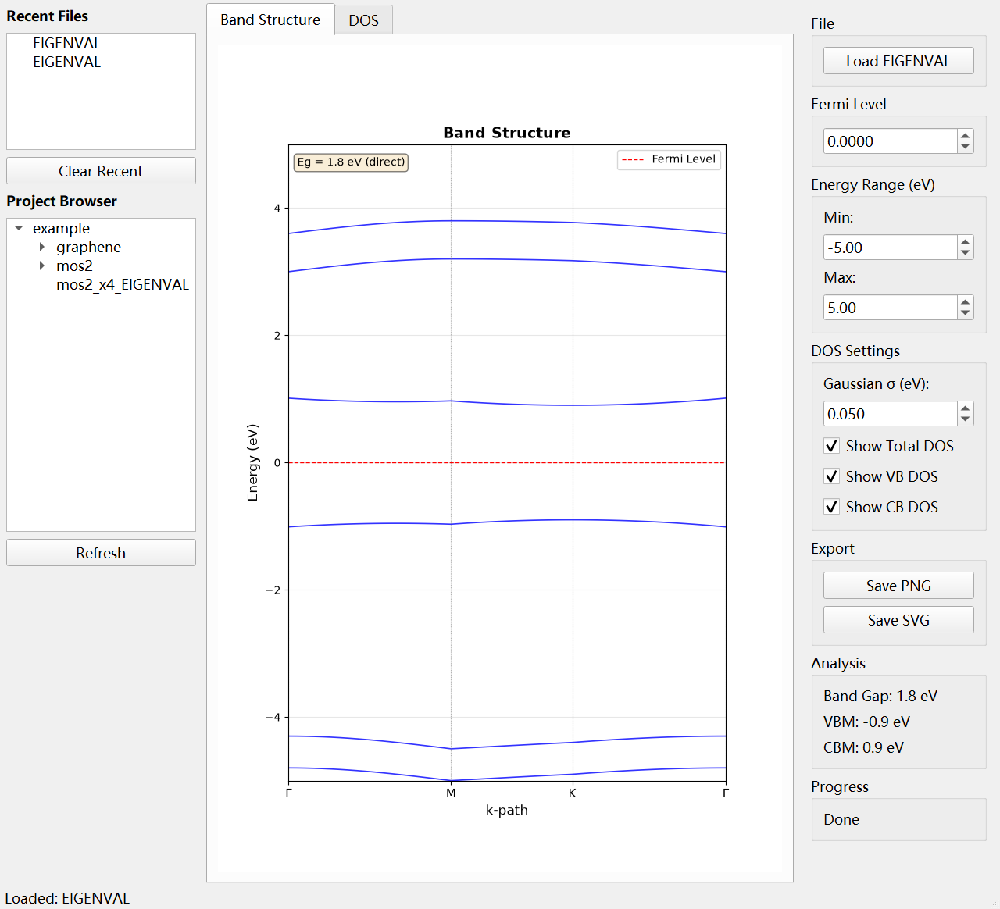
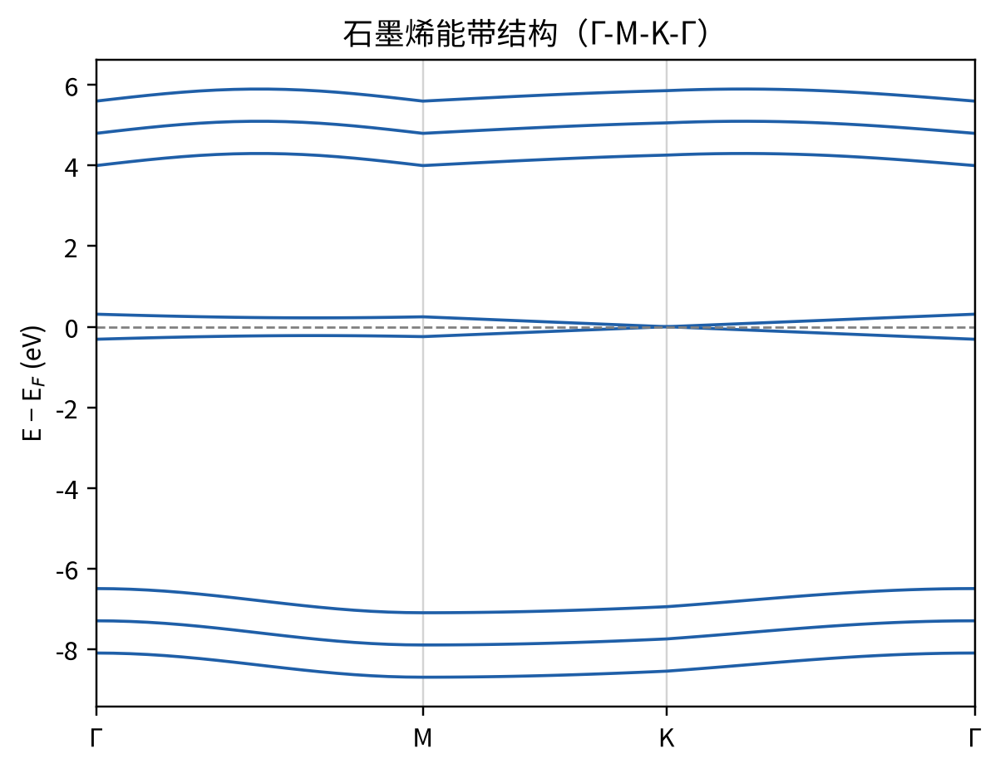
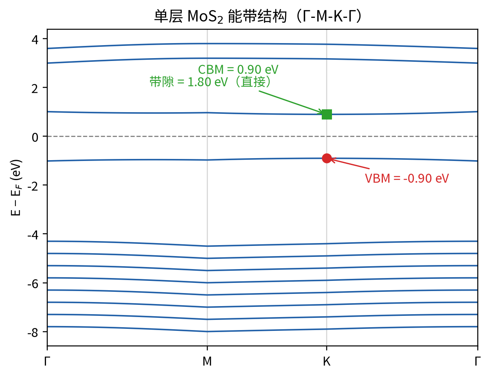
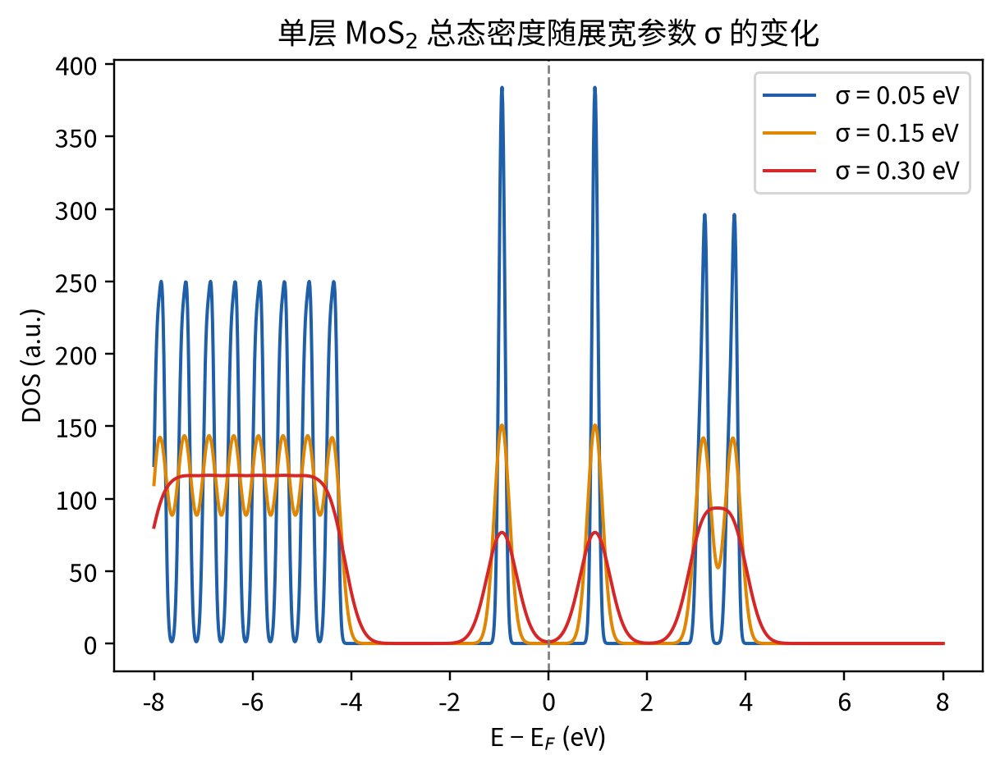

# 2D Material Band Structure Visualizer

> 基于 Raspberry Pi 4B 的二维材料能带结构可视化工具

直接从 VASP 的 `EIGENVAL` 与 `KPOINTS` 文件读取数据，实时绘制能带图与态密度图（DOS），并自动计算带隙、有效质量等关键参数。



---

## 功能特性

- **能带结构可视化** — 自动读取 EIGENVAL + KPOINTS，绘制带高对称点标注的能带图
- **态密度（DOS）** — 基于高斯展宽实时计算总 DOS、价带 DOS、导带 DOS
- **带隙分析** — 自动判断直接/间接带隙，计算 VBM / CBM
- **有效质量估算** — 在带边附近抛物线拟合估算有效质量
- **后台解析** — 使用 QThread 异步解析，大文件不卡界面
- **配置持久化** — JSON 保存用户设置，SQLite 记录计算历史
- **文件树管理** — 左侧目录浏览器 + 最近文件列表，双击即加载
- **导出图片** — 支持 PNG / SVG 高清导出

---

## 快速开始

```bash
# 1. 安装依赖
pip install -r requirements.txt

# 2. 运行
python main.py
```

程序启动后，左侧文件树会自动扫描 `data/example/` 下的示例数据。双击 **graphene** 或 **mos2** 即可加载并查看能带图与 DOS 图。

### 基本操作

| 操作 | 说明 |
|------|------|
| 加载文件 | 点击 **Load EIGENVAL** 或双击文件树中的 `EIGENVAL` |
| 切换视图 | 中央 Tab 切换 **Band Structure** / **DOS** |
| 调节参数 | 右侧面板设置费米能级、能量范围、DOS 展宽 σ |
| 导出图片 | 点击 **Save PNG** / **Save SVG** |

---

## 示例结果

使用 `data/example/` 中自带的石墨烯与单层 MoS₂ 示例数据（均为 58 k 点、Γ-M-K-Γ 路径）：

| 材料 | VBM (eV) | CBM (eV) | 带隙 (eV) | 带隙类型 |
|------|---------|----------|----------|----------|
| 石墨烯 | 0.00 | 0.01 | ≈0.01 | 零带隙半金属（K 点附近线性色散） |
| 单层 MoS₂ | −0.90 | 0.90 | 1.80 | 直接带隙（K 点） |

| 石墨烯能带 | 单层 MoS₂ 能带 |
|-----------|---------------|
|  |  |

DOS 支持高斯展宽参数调节（下图为 σ = 0.05 / 0.15 / 0.30 eV 的对比）：



### 性能参考

在普通 PC（Python 3.12）上的实测数据（解析耗时 / 峰值内存）：

| 测试文件 | k 点数 | 能带数 | 解析时间 | 峰值内存 |
|---------|-------|-------|---------|---------|
| 石墨烯 EIGENVAL | 58 | 8 | ~6 ms | ~11 MB |
| 单层 MoS₂ EIGENVAL | 58 | 12 | ~7 ms | ~17 MB |
| MoS₂ 扩展样例 | 232 | 12 | ~21 ms | ~67 MB |

配合 QThread 后台解析，加载过程中界面保持响应。原始数据见 `paper_results.json`，复现脚本见 `paper_assets.py`。

---

## 技术栈

| 层级 | 技术 | 说明 |
|------|------|------|
| 数据解析 | Python 标准库 + NumPy | 自定义 EIGENVAL / KPOINTS 解析器 |
| 数值计算 | NumPy + SciPy | 数组运算、高斯展宽、抛物线拟合 |
| 可视化 | Matplotlib + PyQt5 | `Qt5Agg` 后端，能带图 + DOS 图 |
| 持久化 | SQLite + JSON | SQLite 存计算历史，JSON 存用户配置 |
| 日志 | Python `logging` | 控制台 + 文件双输出 |
| 并发 | PyQt5 `QThread` | 后台解析 worker，不阻塞 GUI |

---

## 项目结构

```
.
├── main.py                      # 程序入口
├── requirements.txt             # 依赖列表
├── config/
│   └── settings.json            # 用户配置（运行时自动创建，不入库）
├── core/                        # 核心计算
│   ├── parser.py                # EIGENVAL / KPOINTS 解析
│   ├── band_analyzer.py         # 能带分析（带隙、有效质量）
│   └── dos_analyzer.py          # DOS 计算
├── gui/                         # 前端界面
│   ├── main_window.py           # 主窗口
│   ├── band_widget.py           # 能带图组件
│   ├── dos_widget.py            # DOS 图组件
│   ├── control_panel.py         # 控制面板
│   ├── file_tree.py             # 文件树
│   └── workers/
│       └── parse_worker.py      # 后台解析线程
├── storage/                     # 持久化
│   ├── database.py              # SQLite 封装
│   └── config_manager.py        # JSON 配置管理
├── utils/
│   └── logger.py                # 日志配置
├── paper_assets.py              # 生成示例结果与插图的脚本
├── screenshot_gui.py            # 离屏截取主界面的工具脚本
├── paper_figures/               # README 与文档用图
└── data/
    └── example/                 # 示例数据（graphene / mos2 / mos2_x4）
```

---

## 运行环境

- **硬件**：Raspberry Pi 4B（4GB / 8GB RAM 推荐），普通 PC 亦可
- **系统**：Raspberry Pi OS 64-bit（Bookworm 或更新）/ Windows / Linux
- **Python**：3.9+
- **显示**：HDMI 直连 或 VNC 远程

> 树莓派上安装 PyQt5 可能需要额外系统包：`libqt5gui5`、`python3-pyqt5`、`libfreetype6-dev`

---

# vdW Studio — 二维半导体仿真平台（新版本）

> 仓库的新版本：面向二维（范德华）半导体材料的仿真软件，位于 `vdw_studio/` 包，
> 与上面的树莓派轻量可视化版相互独立、互不依赖。
> 设计上仿照 Materials Studio / VESTA / QuantumATK 的工作流，后续将加入
> 面向二维材料科研前沿的特色功能（见 `docs/ROADMAP.md`）。

vdW Studio 内置材料结构库与多种仿真引擎，不依赖外部第一性原理软件即可完成
**结构建模 → 仿真计算 → 性质分析 → 可视化** 全流程，并可导出 POSCAR
无缝衔接 VASP 等第一性原理工作流。

| 单层 MoS₂ 能带（k·p，自旋分辨） | 黑磷烯能带（四带 TB） | 黑磷烯结构（球棍模型） |
|------|------|------|
|  |  |  |

## 功能特性

- **材料结构库** — 10 种内置二维材料：石墨烯、h-BN、硅烯、6 种 1H 相 TMD
  （MoS₂/MoSe₂/WS₂/WSe₂/MoTe₂/WTe₂）、黑磷烯；晶格常数与键长全部取自
  文献实验值，支持 POSCAR/XYZ 导出
- **多引擎仿真**
  - 位点紧束缚引擎：石墨烯（Dirac 锥）、h-BN（交错势）、硅烯（垂直电场
    调控带隙）、黑磷烯（Rudenko 四带模型，各向异性）
  - TMD k·p 引擎：K/-K 谷大质量 Dirac + 三角翘曲 + 自旋轨道（6 种材料
    全套文献参数，含 DFT 与 GW 两套带隙）
  - sp³d⁵ Slater-Koster 非正交引擎（MoS₂ 全 BZ，96 参数）
- **性质分析** — 带隙（直接/间接判据 + 高对称点标注）、有效质量（任意方向）、
  主质量（曲率张量本征分解，各向异性特征量）、费米速度
- **可视化** — 3D 球棍结构图、能带图、DOS、布里渊区与 k 路径
- **图形界面** — 工程树 + 多标签结果页 + 参数面板 + 后台计算线程
- **命令行** — 批量仿真与结构导出
- **物理自检** — 204 项单元测试全部通过；每个模型的带隙/有效质量/劈裂
  与文献数值自动对账，每个参数标注文献出处（防幻觉机制）

## 快速开始

```bash
# 依赖（与树莓派版共用）
pip install -r requirements.txt

# 图形界面
python -m vdw_studio.gui

# 命令行：单材料仿真（输出 PNG/npz/POSCAR/summary.json）
python -m vdw_studio.cli run mos2_kp --out results/mos2

# 命令行：批量运行全部材料
python -m vdw_studio.cli run-all --out results/batch

# 运行测试（物理验证对账）
python -m pytest tests/
```

## 内置材料与验证结果

| 材料 | 引擎 | 带隙（本软件） | 带隙（文献） | 备注 |
|------|------|------|------|------|
| 石墨烯 | 二带 TB | 0（Dirac 锥） | 0 | v_F = 8.74×10⁵ m/s，与 √3\|t\|a/2ħ 精确一致 |
| h-BN | 二带 TB | 3.5 eV | = Δ | 简单参数化，K 点带隙 = 子格势差 |
| 硅烯 | 翘曲 TB | 0（可电场开启） | = E·Δz | K 点带隙电场线性可调 |
| 黑磷烯 | 四带 TB | 1.52 eV (Γ, 直接) | 1.52 eV | 主质量 0.17/0.85 m₀（文献 ~0.17/~0.85） |
| MoS₂ | k·p | 1.670 eV (K) | 1.670 eV | m_e 0.44/0.45、m_h 0.57/0.56 m₀（文献 0.46/0.43、0.54/0.61） |
| MoSe₂ | k·p | 1.400 eV (K) | 1.400 eV | 全部 6 种 TMD 带隙精确吻合 |
| WS₂ | k·p | 1.600 eV (K) | 1.600 eV | 谷自旋劈裂符号与 MoX₂ 相反（已验证） |
| WSe₂ | k·p | 1.300 eV (K) | 1.300 eV | 2Δ_vb = 466 meV |
| MoTe₂ | k·p | 0.997 eV (K) | 0.997 eV | |
| WTe₂ | k·p | 0.792 eV (K) | 0.792 eV | |
| MoS₂ (sp³d⁵) | SK 非正交 | 待验证 | 1.805 eV | 框架就绪，待 Nanoskif 相位约定（见 ROADMAP） |

## 项目结构（vdW Studio 部分）

```
vdw_studio/
├── elements.py       # 元素数据库（质量/共价半径/CPK颜色）
├── structure/        # 晶格、晶体、二维材料构建器
├── engine/           # k路径、紧束缚模型、TMD k·p、sp³d⁵ Slater-Koster、求解器
├── analysis/         # 带隙/有效质量/主质量/费米速度
├── presets/          # 材料预设库（一键端到端 + 文献参考对账）
├── visualization/    # 结构/能带/DOS/布里渊区绘图
├── gui/              # PyQt5 图形界面
├── io/               # POSCAR/XYZ 导出
└── cli.py            # 命令行接口
tests/                # 204 项测试（含物理验证对账）
examples/             # 示例脚本（MoS₂ k·p / 黑磷烯 / 结构导出）
docs/REFERENCES.md    # 全部物理参数的文献溯源表
docs/ROADMAP.md       # 科研前沿功能规划
```

## 参考文献

全部物理参数的逐条出处见 **[docs/REFERENCES.md](docs/REFERENCES.md)**，
主要包括：

- A. Kormányos *et al.*, **2D Mater. 2**, 022001 (2015)（TMD k·p 与材料参数总表）
- A. Kormányos *et al.*, **Phys. Rev. B 88**, 045416 (2013)
- F. Zahid *et al.*, **Phys. Rev. B 87**, 125302 (2013)（MoS₂ sp³d⁵ TB）
- A. N. Rudenko & M. I. Katsnelson, **Phys. Rev. B 89**, 201408(R) (2014)（黑磷烯）
- S. Reich *et al.*, **Phys. Rev. B 66**, 035412 (2002)（石墨烯 TB）

## 路线图

见 **[docs/ROADMAP.md](docs/ROADMAP.md)**：应变工程、介电环境与激子物理、
谷-自旋物理深化、转角莫尔超晶格、多层堆叠等面向二维材料科研前沿的
特色功能规划。

## 许可证

MIT License
