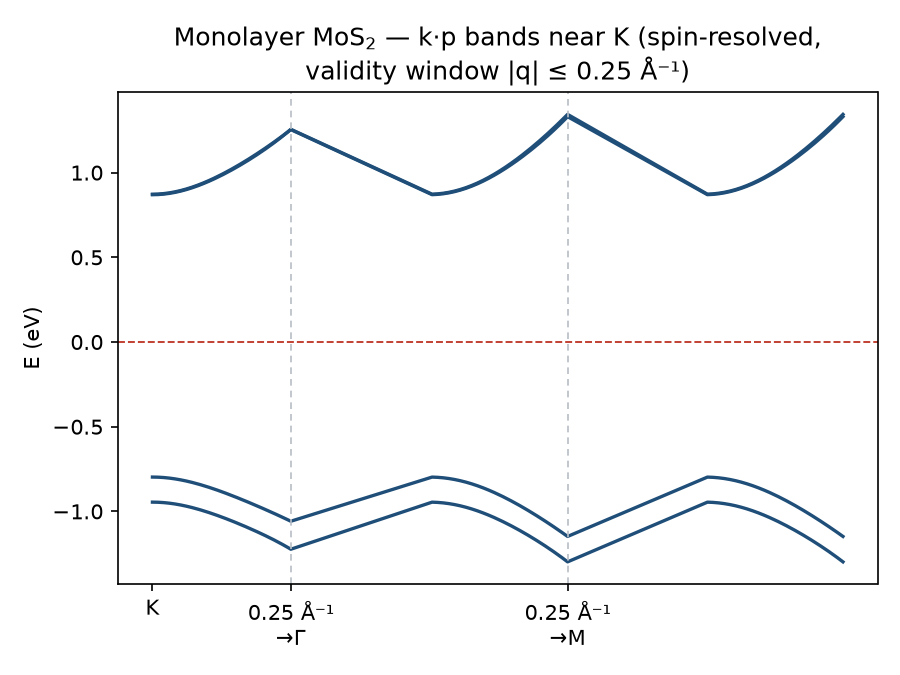
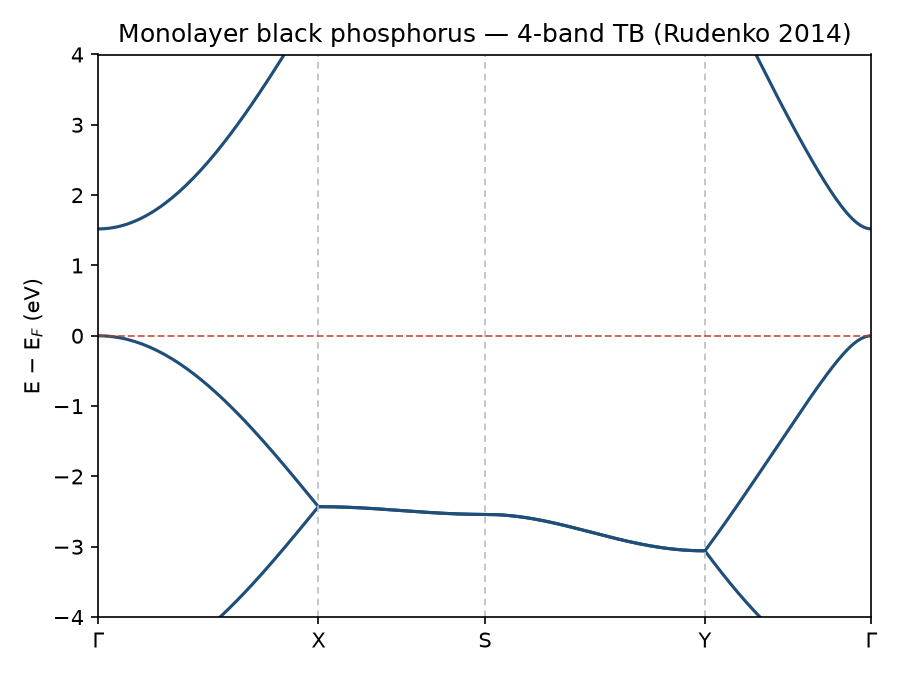
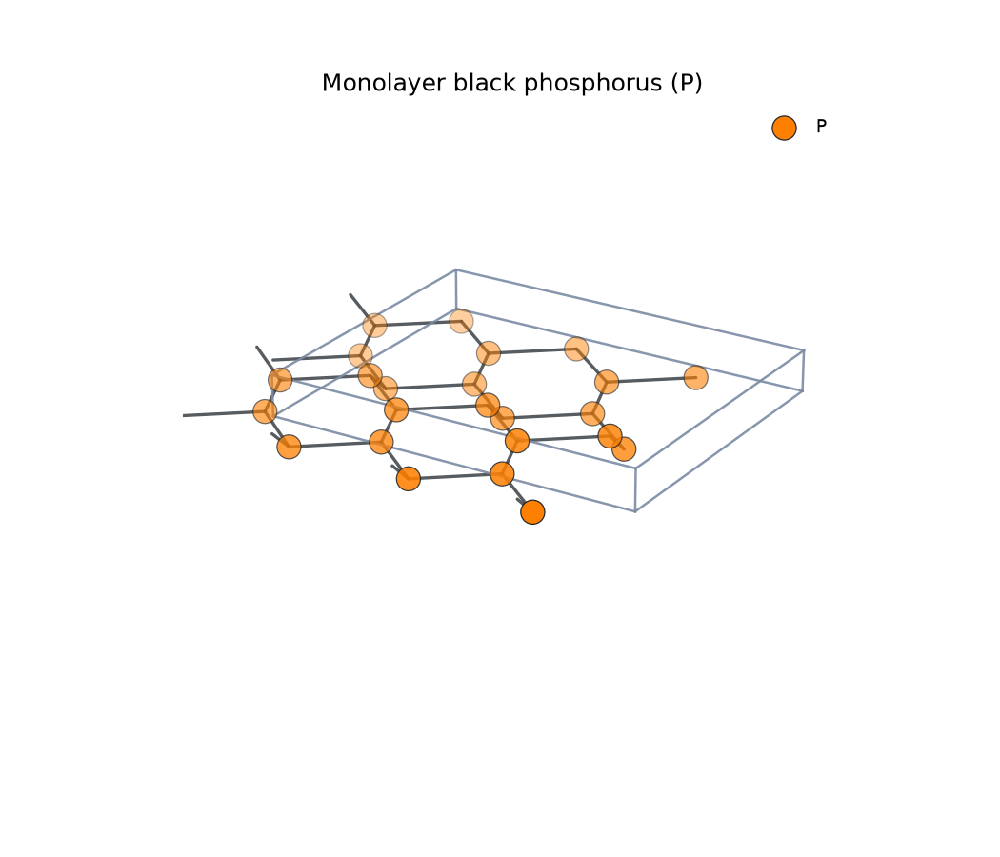
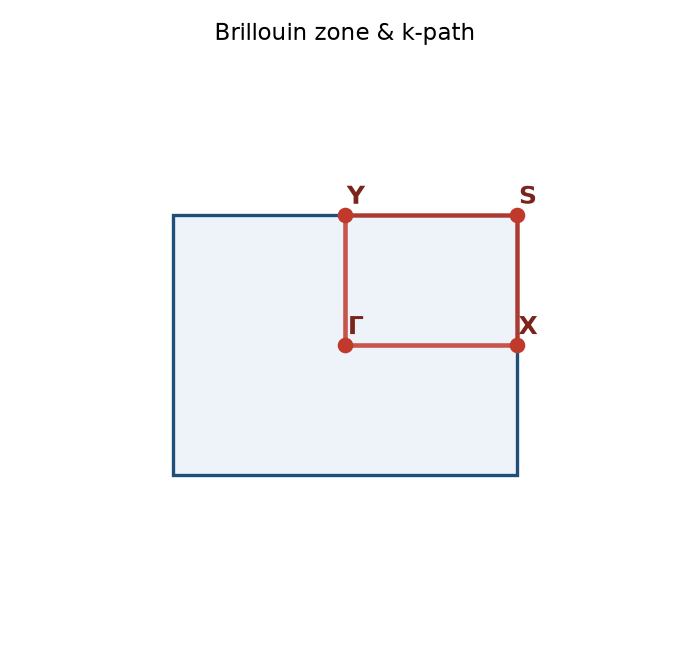
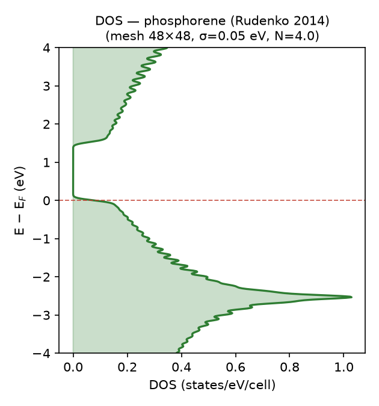
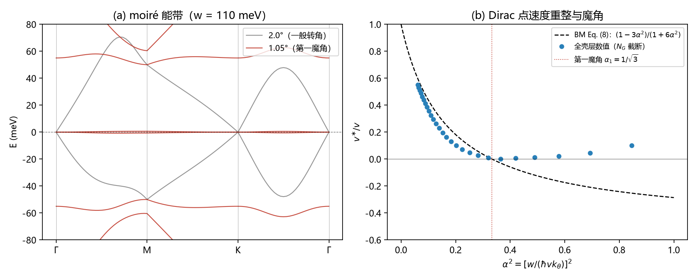

# vdW Studio — 二维半导体仿真平台

> 本仓库的第二个版本，位于 `vdw_studio/` 包，与根目录的树莓派轻量可视化版
> （[BandViz](../README.md)）相互独立、互不依赖。
> 设计上仿照 Materials Studio / VESTA / QuantumATK 的工作流，后续将加入
> 面向二维材料科研前沿的特色功能（见 [docs/ROADMAP.md](../docs/ROADMAP.md)）。

vdW Studio 内置材料结构库与多种仿真引擎，不依赖外部第一性原理软件即可完成
**结构建模 → 仿真计算 → 性质分析 → 可视化** 全流程，并可导出 POSCAR
无缝衔接 VASP 等第一性原理工作流。

| 单层 MoS₂ 能带（k·p，自旋分辨） | 黑磷烯能带（四带 TB） | 黑磷烯结构（球棍模型） |
|------|------|------|
|  |  |  |

| 黑磷烯布里渊区 | 黑磷烯态密度 |
|------|------|
|  |  |

| 转角双层石墨烯 moiré 平带（魔角 1.05°） |
|------|
|  |

---

## 功能特性

- **材料结构库** — 11 种内置二维材料：石墨烯、双层石墨烯 (AB)、h-BN、硅烯、
  6 种 1H 相 TMD（MoS₂/MoSe₂/WS₂/WSe₂/MoTe₂/WTe₂）、黑磷烯；
  晶格常数与键长全部取自文献实验值，支持 POSCAR/XYZ 导出
- **应变工程** — 双轴/单轴应变（键长标度律重整 hopping），石墨烯费米速度
  v_F(ε) = v_F(0)/(1+ε) 与解析式精确一致，界面可调
- **多引擎仿真**
  - **位点紧束缚引擎**：石墨烯（Dirac 锥）、h-BN（交错势）、硅烯（垂直电场
    调控带隙）、黑磷烯（Rudenko 四带模型，各向异性）
  - **TMD k·p 引擎**：K/-K 谷大质量 Dirac + 三角翘曲 + 自旋轨道（6 种材料
    全套文献参数，含 DFT 与 GW 两套带隙）
  - **sp³d⁵ Slater-Koster 非正交引擎**（MoS₂ 全 BZ，96 参数，开发中）
- **性质分析** — 带隙（直接/间接判据 + 高对称点标注）、有效质量（任意方向）、
  主质量（曲率张量本征分解，各向异性特征量）、费米速度
- **可视化** — 3D 球棍结构图、能带图、DOS、布里渊区与 k 路径
- **图形界面** — 工程树 + 多标签结果页（结构/能带/DOS/布里渊区）+ 参数面板 +
  后台计算线程
- **命令行** — 批量仿真与结构导出
- **谷物理** — Berry 曲率热图、谷半 Chern 数、圆偏振选择定则
  （K/−K 强度比 >10⁴，时间反演精确验证）
- **谷磁矩与谷 Zeeman** — 轨道磁矩通式（RMP 2010 波包表述）+
  带边 μ*_B = (m₀/m*)·μ_B + 谷劈裂 ΔE = −2m·μ_B·B，
  三路独立实现对账（RMP 原式有限差分 / 速度矩阵元 / 两带解析）
- **2D 激子求解器** — Rytova–Keldysh 屏蔽势 + Fourier–Bessel DVR，
  库仑极限与 2D 氢原子精确谱对账（<2%）；四种 TMD 的 μ/r₀ 默认值
  按 Berkelbach 2013 Table 文献标定，精确解与文献变分束缚能对账
  （偏差 2–5%），`solve_preset_exciton()` 一键介电工程调谐
- **转角 moiré 引擎** — Bistritzer–MacDonald 连续模型（任意转角
  平面波展开）：**魔角 θ=1.05° 数值复现**、第一壳层解析速度
  v*/v=(1−3α²)/(1+6α²)、k=0 双零模、魔角平带 ~8 meV
- **结果数据库** — SQLite 记录每次仿真（材料/参数/结果 JSON），
  高通量批量筛选与历史查询（CLI `history`）
- **物理自检** — 298 项单元测试全部通过；每个模型的带隙/有效质量/劈裂
  与文献数值自动对账，每个参数标注文献出处（防幻觉机制）

---

## 快速开始

```bash
# 依赖（与树莓派版共用）
pip install -r requirements.txt

# 图形界面
python -m vdw_studio.gui

# 命令行：单材料仿真（输出 PNG/npz/POSCAR/summary.json）
python -m vdw_studio.cli run mos2_kp --out results/mos2

# 命令行：批量运行全部材料
python -m vdw_studio.cli run-all --out results/batch

# 导出结构（POSCAR/XYZ）
python -m vdw_studio.cli export MoS2 --out structures

# 运行测试（物理验证对账）
python -m pytest tests/
```

示例脚本（生成 README 用图）：

```bash
python examples/run_mos2_kp.py        # MoS₂ k·p 谷物理
python examples/run_phosphorene.py    # 黑磷烯各向异性
python examples/run_moire.py          # 转角双层石墨烯 moiré 平带（魔角 1.05°）
python examples/run_exciton.py        # 2D 激子束缚能（Keldysh 势）
python examples/export_all_structures.py  # 全部材料结构导出
```

---

## 内置材料与验证结果

| 材料 | 引擎 | 带隙（本软件） | 带隙（文献） | 备注 |
|------|------|------|------|------|
| 石墨烯 | 二带 TB | 0（Dirac 锥） | 0 | v_F = 8.74×10⁵ m/s，与 √3\|t\|a/2ħ 精确一致 |
| h-BN | 二带 TB | 3.5 eV | = Δ | 简单参数化，K 点带隙 = 子格势差 |
| 硅烯 | 翘曲 TB | 0（可电场开启） | = E·Δz | K 点带隙电场线性可调 |
| 双层石墨烯 (AB) | 四位点 TB | 0（可电场开启） | ≈ \|U\| | McCann 最小模型：抛物线触碰带，m* ≈ 0.046 m₀（文献值），电场线性开隙 |
| 黑磷烯 | 四带 TB | 1.52 eV (Γ, 直接) | 1.52 eV | 主质量 0.17/0.85 m₀（文献 ~0.17/~0.85） |
| MoS₂ | k·p | 1.670 eV (K) | 1.670 eV | m_e 0.44/0.45、m_h 0.57/0.56 m₀（文献 0.46/0.43、0.54/0.61） |
| MoSe₂ | k·p | 1.400 eV (K) | 1.400 eV | 全部 6 种 TMD 带隙精确吻合 |
| WS₂ | k·p | 1.600 eV (K) | 1.600 eV | 谷自旋劈裂符号与 MoX₂ 相反（已验证） |
| WSe₂ | k·p | 1.300 eV (K) | 1.300 eV | 2Δ_vb = 466 meV |
| MoTe₂ | k·p | 0.997 eV (K) | 0.997 eV | |
| WTe₂ | k·p | 0.792 eV (K) | 0.792 eV | |
| MoS₂ (sp³d⁵) | SK 非正交 | 待验证 | 1.805 eV | 框架就绪，待 Nanoskif 相位约定（见 ROADMAP） |
| 转角双层石墨烯 | BM 连续模型 | 0（魔角平带） | — | 魔角 1.05° 复现（BM Fig. 3）；v*/v=(1−3α²)/(1+6α²) 精确；平带 ~8 meV |

---

## 项目结构

```
vdw_studio/
├── elements.py       # 元素数据库（质量/共价半径/CPK颜色）
├── structure/        # 晶格、晶体、二维材料构建器
│   ├── lattice.py    #   晶格矩阵/倒格子/应变缩放
│   ├── crystal.py    #   原子/周期近邻/成键判定/超胞
│   └── builders.py   #   10 种二维材料构建器
├── engine/
│   ├── kpath.py      #   高对称点与 k 路径（Γ-M-K-Γ 等）
│   ├── models.py     #   位点紧束缚模型（石墨烯/hBN/硅烯/磷烯/双层）
│   ├── kp_tmd.py     #   TMD k·p 引擎（谷+自旋，6 材料参数库）
│   ├── slater_koster.py  # SK 角因子（张量旋转严格构造）
│   ├── zahid_mos2.py #   MoS₂ sp³d⁵ 非正交 TB（96 参数）
│   ├── moire.py      #   转角双层石墨烯 BM 连续模型（moiré 平带）
│   └── solver.py     #   能带/DOS 求解器
├── analysis/         # 带隙/有效质量/Berry曲率/谷磁矩/谷物理/激子求解器
├── presets/          # 材料预设库（一键端到端 + 文献参考对账）
├── visualization/    # 结构/能带/DOS/布里渊区绘图
├── gui/              # PyQt5 图形界面
├── io/               # POSCAR/XYZ 导出
└── cli.py            # 命令行接口
```

---

## 参考文献

全部物理参数的逐条出处见 **[docs/REFERENCES.md](../docs/REFERENCES.md)**，
主要包括：

- A. Kormányos *et al.*, **2D Mater. 2**, 022001 (2015)（TMD k·p 与材料参数总表）
- A. Kormányos *et al.*, **Phys. Rev. B 88**, 045416 (2013)
- F. Zahid *et al.*, **Phys. Rev. B 87**, 125302 (2013)（MoS₂ sp³d⁵ TB）
- A. N. Rudenko & M. I. Katsnelson, **Phys. Rev. B 89**, 201408(R) (2014)（黑磷烯）
- S. Reich *et al.*, **Phys. Rev. B 66**, 035412 (2002)（石墨烯 TB）
- D. Xiao, M.-C. Chang, Q. Niu, **Rev. Mod. Phys. 82**, 1959 (2010)（Berry 相位/轨道磁矩）
- D. Xiao *et al.*, **Phys. Rev. Lett. 108**, 196802 (2012)（TMD 谷物理）
- T. C. Berkelbach *et al.*, **Phys. Rev. B 88**, 045318 (2013)（TMD 激子参数）
- R. Bistritzer & A. H. MacDonald, **Phys. Rev. B 84**, 035440 (2011)（转角石墨烯 moiré）

---

## 路线图

见 **[docs/ROADMAP.md](../docs/ROADMAP.md)**：应变工程、介电环境与激子物理
（Rytova–Keldysh 势）、谷-自旋物理深化（Berry 曲率/谷 Zeeman）、
转角莫尔超晶格（Bistritzer–MacDonald 模型）、多层堆叠等科研前沿规划。

## 许可证

MIT License
